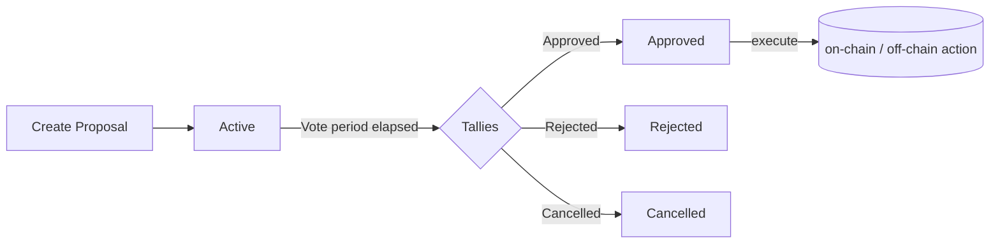

# Governance & Proposals

Each project registered on Tansu automatically gets its own **Decentralized Autonomous Organization (DAO)** smart-contract state. This DAO enables maintainers and community members to discuss, vote and execute actions in an auditable, on-chain way.

## Proposal lifecycle

Below is a mermaid diagram illustrating the proposal lifecycle:

1. **create_proposal** – a maintainer submits a new proposal (title, ipfs, voting_ends_at, public_voting).
2. **Active** – during the voting window members cast weighted votes (approve, reject, abstain).
3. **Tallies** – once voting ends, anyone can tally (using execute) – if anonymous, tallies & seeds are supplied.
4. The proposal status becomes **Approved**, **Rejected** or **Cancelled** (see `_types.ProposalStatus_`).
5. In case of **Approved**, a follow‑up XDR transaction (embedded in the proposal) is submitted automatically.

## Public vs. Anonymous voting

| Mode | Call | On-chain storage | Who can see the vote? |
| --- | --- | --- | --- |
| Public | `vote(PublicVote)` | Full vote payload | Everyone, instantly |
| Anonymous | `vote(AnonymousVote)` | 3 BLS-12-381 commitments | Nobody (until execute) |

Anonymous voting requires a one-time configuration (`anonymous_voting_setup`). The contract stores two generator points and the ECDH public key used to encrypt voters' seeds.

The helper `build_commitments_from_votes` can be called in simulation to reproduce the exact commitments client-side.

## Weights & quorum

The effective weight of a vote is given by [`get_max_weight`](./membership.mdx). The contract does **not** impose a fixed quorum rule – instead it considers the raw tallies:

- `approve > reject` → **Approved**
- `reject ≥ approve` → **Rejected**
- Any exceptional path (e.g. maintainer forcing a stop) → **Cancelled**

Custom quorum logic (percentage, thresholds…) can be built off-chain before deciding whether to call `execute`.

## Pagination helpers

DAO state is paginated to keep storage small and predictable:

- `get_dao(project_key, page)` – returns up to **9** proposals
- `get_proposal(project_key, proposal_id)` – fetch a single proposal by id

`MAX_PAGES` is 1000, meaning a project can store up to **9000 proposals** on-chain.
