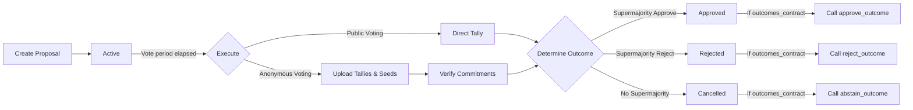
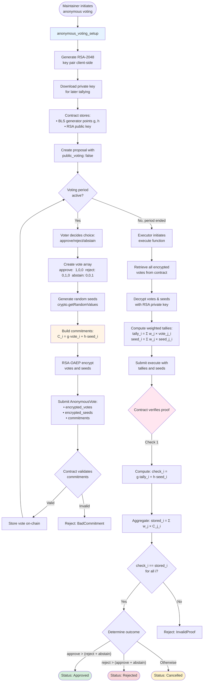
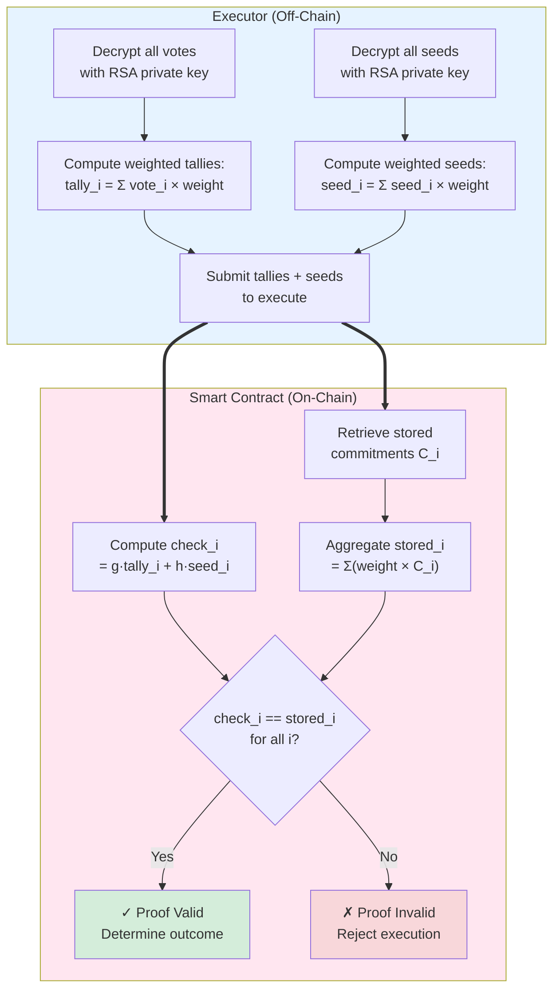

# Governance & Proposals

Each project registered on Tansu automatically gets its own **Decentralized Autonomous Organization (DAO)** smart-contract state. This DAO enables maintainers and community members to discuss, vote and execute actions in an auditable, on-chain way.

## Proposal lifecycle

1. **create_proposal** – a maintainer submits a new proposal (title, ipfs, voting_ends_at, public_voting, optional outcomes_contract).
2. **Active** – during the voting window members cast weighted votes (approve, reject, abstain).
3. **Tallies** – once voting ends, a maintainer can tally (using execute) – if anonymous, tallies & seeds are supplied.
4. The proposal status becomes **Approved**, **Rejected** or **Cancelled** based on supermajority rules.
5. If an **outcomes_contract** is specified, the appropriate callback is triggered automatically:
   - **Approved** → `approve_outcome()`
   - **Rejected** → `reject_outcome()`
   - **Cancelled** → `abstain_outcome()`

### Voting Timeline

The contract enforces strict voting deadlines:

- Votes can only be cast **before** the `voting_ends_at` timestamp
- Attempts to vote after the deadline will be rejected
- Only maintainers can execute proposals **after** the voting period ends
- Voting periods must be between 1 day and 30 days from creation

## Public vs. Anonymous voting

Anonymous voting uses cryptographic commitments (BLS12-381) to keep individual votes private until tallying.

| Mode | Call | On-chain storage | Who can see the vote? |
| --- | --- | --- | --- |
| Public | `vote(PublicVote)` | Full vote payload | Everyone, instantly |
| Anonymous | `vote(AnonymousVote)` | 3 BLS-12-381 commitments | Nobody (until execute) |

Anonymous voting requires a one-time configuration (`anonymous_voting_setup`). The contract stores two BLS12-381 generator points (g, h) and an RSA-2048 public key used to encrypt voters' votes and seeds.

### Anonymous Voting Flow

### Workflow Summary

1. **Setup**: Maintainer calls `anonymous_voting_setup` with an RSA-2048 public key
2. **Proposal**: Maintainer creates an anonymous proposal with `public_voting: false`
3. **Voting**: Members generate commitments and encrypted payloads off-chain, then submit `AnonymousVote` via the contract
4. **Execution**: After voting ends, any maintainer with the RSA private key decrypts votes, computes weighted tallies, and submits to `execute()` for verification

:::tip For a high-level sequence diagram of the anonymous voting flow, see the [User Flows documentation](./user_flows.mdx#2-governance-flow). :::

### Key Management & Trust Model

**Critical Trust Assumptions:**

The anonymous voting system requires a trusted party (executor) to hold the RSA-2048 private key:

- **Key Holder Power**: Can decrypt ALL votes at any time
- **Single Point of Trust**: Creates centralization in otherwise decentralized governance
- **Required Trust**:
  - Will not prematurely reveal votes (prevents social pressure/bribery)
  - Will execute the proposal after voting ends
  - Will provide correct tallies (cryptographic proof prevents lying, but they could refuse to execute)

**Security Implications:**

- If key is **lost**: Proposal becomes unexecutable, votes locked forever
- If key is **leaked**: All vote privacy is compromised retroactively
- If holder is **malicious**: Can reveal votes early but cannot forge results

**Best Practices:**

1. **Document key holder** in proposal metadata (e.g., IPFS content)
2. **Use threshold cryptography** for key sharing among multiple maintainers
3. **Consider time-locked encryption** for fully trustless operation (future enhancement)
4. **Rotate executors** across different proposals to distribute trust
5. **Generate fresh keys** per proposal (currently one key per project)

**Alternative: Public Voting**

For proposals requiring no trust assumptions, use public voting mode where tallies are immediately visible and verifiable by anyone.

## Anonymous Voting: Technical Deep Dive

### Key Generation & Setup

**RSA-2048 Key Pairs:**

- Generated client-side using Web Crypto API (RSA-OAEP with SHA-256)
- Private key must be downloaded before proposal submission
- Used later by executor for tallying votes
- Public key stored in smart contract's `AnonymousVoteConfig`

**BLS12-381 Generator Points:**

- Created deterministically via `hash_to_g1()` with domain separation tags (DST)
- Vote generator: `g = hash_to_g1("VOTE_GENERATOR", "VOTE_COMMITMENT")`
- Seed generator: `h = hash_to_g1("SEED_GENERATOR", "VOTE_SEED")`
- DST ensures cryptographic independence between generator points
- Each generator is a 96-byte G1 point on the BLS12-381 elliptic curve

### Pedersen Commitment Scheme

:::danger Never Submit as Transaction The `build_commitments_from_votes` function **MUST ONLY** be called in simulation mode (read-only). **NEVER** submit this as a transaction on-chain, as it would expose your votes and seeds publicly, completely breaking anonymity. Always use it client-side or via RPC simulation. :::

Pedersen commitments over the BLS12-381 G1 group provide cryptographic hiding.

**Commitment Construction:**

$$
C[i] = g \cdot v[i] + h \cdot r[i]
$$

Where:

- `g, h` = generator points (96-byte BLS12-381 G1 points)
- `v[i]` = vote value (0 or 1) for choice i ∈ \{0:approve, 1:reject, 2:abstain\}
- `r[i]` = cryptographically random seed (generated via `crypto.getRandomValues()`)
- `·` = scalar multiplication on elliptic curve
- `+` = elliptic curve point addition

**Vote Array Representation:**

- Approve: `[1, 0, 0]`
- Reject: `[0, 1, 0]`
- Abstain: `[0, 0, 1]`

**Properties:**

- **Hiding**: Commitments reveal nothing about the vote (information-theoretically secure due to random seed)
- **Binding**: Cannot change vote after committing (computationally secure under discrete log assumption)
- **Homomorphic**: Weighted commitments aggregate:

$$
\sum w_j \cdot C_{j,i} = g \cdot \sum w_j v_{j,i} + h \cdot \sum w_j r_{j,i}
$$

### Vote Encryption

**RSA-OAEP Encryption:**

- Each vote and seed value encrypted individually with project's RSA public key
- Uses RSA-OAEP padding scheme with SHA-256
- Ensures only the private key holder can decrypt

**Replay Attack Prevention:**

- Salt prefix: `"${voter_address}:${project}:${proposal_id}:${value}"`
- Binds encryption to specific voter, project, and proposal
- Prevents reuse of encrypted values across different contexts

**On-Chain Storage:**

- Only commitments (3 G1 points) stored in clear
- Encrypted votes and seeds stored alongside commitments
- Contract validates commitment structure (3 valid G1 points)

### Execution Phase

**Decryption Process:**

1. Executor retrieves all encrypted votes from contract
2. Uses RSA private key to decrypt each vote and seed
3. Verifies decrypted values match expected format

**Weighted Aggregation:**

$$
\begin{align}
\text{tally}[i] &= \sum (\text{vote}[i] \times \text{weight}) \\
\text{seed\_tally}[i] &= \sum (\text{seed}[i] \times \text{weight})
\end{align}
$$

For each choice i ∈ \{approve, reject, abstain\}.

**Proof Verification:**

The contract verifies tallies without seeing individual votes:

**Step-by-step verification:**

1. **Compute expected commitment from tallies:**

$$
\text{check}[i] = g \cdot \text{tally}[i] + h \cdot \text{seed\_tally}[i]
$$

2. **Aggregate stored commitments with weights:**

$$
\text{stored}[i] = \sum (\text{weight} \times C[i])
$$

3. **Verify equality:**

$$
\text{check}[i] = \text{stored}[i] \quad \forall i
$$

**Mathematical Proof of Correctness:**

$$
\begin{align}
\sum (w \cdot C[i]) &= \sum (w \cdot (g \cdot v[i] + h \cdot r[i])) \\
                     &= \sum (w \cdot g \cdot v[i]) + \sum (w \cdot h \cdot r[i]) \\
                     &= g \cdot \sum (w \cdot v[i]) + h \cdot \sum (w \cdot r[i]) \\
                     &= g \cdot \text{tally}[i] + h \cdot \text{seed\_tally}[i]
\end{align}
$$

**Privacy Preservation:**

- Only final weighted tallies are revealed
- Individual votes remain encrypted on-chain forever
- Zero-knowledge proof: reveals correctness without revealing votes

## Collateral & Economic Security

To prevent spam and ensure serious participation, Tansu requires collateral deposits:

**Amounts:**

- Proposal creation: **100 XLM** (PROPOSAL_COLLATERAL)
- Each vote: **10 XLM** (VOTE_COLLATERAL)

**Refund Policy:**

- All collateral is **fully refunded** when proposal is executed
- Proposer gets collateral back even if rejected
- Exception: **Revoked proposals** forfeit collateral (malicious/spam deterrent)

See `contract_dao.rs` lines 10-11 for constant definitions.

## Error Handling

Common errors when interacting with governance functions:

| Error | When it occurs | Solution |
| --- | --- | --- |
| `ProposalInputValidation` | Invalid title length, voting period, or IPFS CID | Check: title 10-256 chars, voting 1-30 days, IPFS 32-64 chars |
| `ProposalVotingTime` | Voting before period starts or after it ends | Wait for voting period or execute after deadline |
| `AlreadyVoted` | Member tries to vote twice on same proposal | Each member can only vote once |
| `UnknownMember` | Voter not registered as member | Call `add_member` first |
| `VoterWeight` | Vote weight exceeds member's maximum | Check `get_max_weight`, vote with valid weight |
| `WrongVoteType` | Public vote on anonymous proposal (or vice versa) | Match vote type to proposal configuration |
| `BadCommitment` | Invalid BLS12-381 commitment structure | Ensure 3 valid G1 points (96 bytes each) |
| `TallySeedError` | Missing/invalid tallies or seeds for anonymous vote | Provide valid 3-element vectors |
| `InvalidProof` | Commitment verification failed | Check decryption, weights, and tally computation |
| `CollateralError` | Insufficient balance for collateral | Ensure sufficient XLM balance |
| `VoteLimitExceeded` | More than 1000 votes on proposal | DoS protection, proposal closed to new votes |
| `NoAnonymousVotingConfig` | Anonymous voting not set up for project | Run `anonymous_voting_setup` first |

See `contracts/tansu/src/errors.rs` for complete error definitions.

## DoS Protection & Limits

The contract enforces several limits to prevent abuse:

**Voting Limits:**

- `MAX_VOTES_PER_PROPOSAL`: **1000 votes** per proposal
- Once reached, proposal closes to new votes (existing votes still count)

**Proposal Limits:**

- `MAX_PROPOSALS_PER_PAGE`: **9 proposals** per page
- `MAX_PAGES`: **1000 pages** maximum
- Total capacity: **9,000 proposals** per project

**Time Limits:**

- `MIN_VOTING_PERIOD`: **24 hours** (1 day)
- `MAX_VOTING_PERIOD`: **30 days**

**Size Limits:**

- Proposal title: **10-256 characters**
- IPFS CID: **32-64 characters**

See `contract_dao.rs` lines 10-17 for constant definitions.

## Weights & quorum

The effective weight of a vote is given by [`get_max_weight`](./membership.mdx). The contract implements a **supermajority governance model** that requires broad consensus before approving any proposal.

### Voting Decision Logic

The contract considers the weighted tallies using supermajority rules:

- `approve > (abstain + reject)` → **Approved**
- `reject > (abstain + approve)` → **Rejected**
- Otherwise → **Cancelled** (including when `approve = reject`)

### Why Supermajority?

Supermajority ensures broad consensus, considers abstain votes meaningful, and prevents hasty decisions.

Custom quorum logic (percentage, thresholds…) can be built off-chain before deciding whether to call `execute`.

### Voting Eligibility

To cast a vote on a proposal, users must:

- Be registered as a member using `add_member`
- Have one or more badges assigned for the project (see [Membership & Badges](./membership.mdx))
- Vote with a weight not exceeding their maximum allowed weight
- Vote before the proposal's deadline

Members with zero voting weight (no badges) cannot participate in voting.

## Pagination helpers

DAO state is paginated to keep storage small and predictable:

- `get_dao(project_key, page)` – returns up to **9** proposals
- `get_proposal(project_key, proposal_id)` – fetch a single proposal by id

`MAX_PAGES` is 1000, meaning a project can store up to **9,000 proposals** on-chain.
