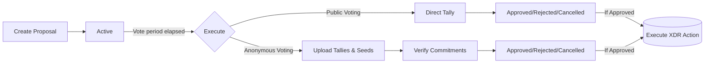

# Governance & Proposals

Each project registered on Tansu automatically gets its own **Decentralized Autonomous Organization (DAO)** smart-contract state. This DAO enables maintainers and community members to discuss, vote and execute actions in an auditable, on-chain way.

## Proposal lifecycle

Below is a mermaid diagram illustrating the proposal lifecycle:

1. **create_proposal** – a maintainer submits a new proposal (title, ipfs, voting_ends_at, public_voting).
2. **Active** – during the voting window members cast weighted votes (approve, reject, abstain).
3. **Tallies** – once voting ends, a maintainer can tally (using execute) – if anonymous, tallies & seeds are supplied.
4. The proposal status becomes **Approved**, **Rejected** or **Cancelled** (see `_types.ProposalStatus_`).
5. In case of **Approved**, a follow‑up XDR transaction (embedded in the proposal) is submitted automatically.

### Voting Timeline

The contract enforces strict voting deadlines:

- Votes can only be cast **before** the `voting_ends_at` timestamp
- Attempts to vote after the deadline will be rejected
- Only maintainers can execute proposals **after** the voting period ends
- Voting periods must be between 1 day and 30 days from creation

## Public vs. Anonymous voting

Anonymous voting in Tansu uses a cryptographic commitment scheme (BLS12-381) to keep individual votes private until tallying. This is ideal for sensitive decisions or when you want to reduce social pressure and bias.

| Mode | Call | On-chain storage | Who can see the vote? |
| --- | --- | --- | --- |
| Public | `vote(PublicVote)` | Full vote payload | Everyone, instantly |
| Anonymous | `vote(AnonymousVote)` | 3 BLS-12-381 commitments | Nobody (until execute) |

Anonymous voting requires a one-time configuration (`anonymous_voting_setup`). The contract stores two generator points and the ECDH public key used to encrypt voters' seeds.

The helper `build_commitments_from_votes` can be called in simulation to reproduce the exact commitments client-side.

- Each vote is committed as: $C = G(v) \cdot H(r)$ where `G`, `H` are generator points, `v` is the vote, and `r` is a random seed.
- Only commitments are stored on-chain. The actual votes and seeds are encrypted off-chain and revealed at tally time.
- At tally, the contract checks that the sum of commitments matches the commitments derived from the revealed tallies and seeds.

### Workflow

1. **Setup**: maintainers calls `anonymous_voting_setup` to share a public key.
2. **Proposal**: Maintainer creates an anonymous proposal with `public_voting: false`.
3. **Voting**: Members generate commitments and encrypted payloads off-chain, then submit `AnonymousVote` via the contract.
4. **Tally**: After voting ends, encrypted votes and seeds are decrypted off-chain, summed, and submitted to the contract for verification and execution.

## Weights & quorum

The effective weight of a vote is given by [`get_max_weight`](./membership.mdx). The contract implements a **supermajority governance model** that requires broad consensus before approving any proposal.

### Voting Decision Logic

The contract considers the weighted tallies using supermajority rules:

- `approve > (abstain + reject)` → **Approved**
- `reject > (abstain + approve)` → **Rejected**
- Otherwise → **Cancelled** (including when approve = reject)

This means that to approve a proposal, the approve votes must exceed the combined weight of all reject and abstain votes. Similarly, to reject a proposal, the reject votes must exceed the combined weight of all approve and abstain votes.

### Why Supermajority?

This supermajority approach ensures that:

- **Broad consensus** is required before making changes
- **Abstain votes matter** - they represent active participation but uncertainty
- **Conservative governance** - proposals need clear support to pass
- **Protection against hasty decisions** - changes require overwhelming support

Custom quorum logic (percentage, thresholds…) can be built off-chain before deciding whether to call `execute`.

### Voting Eligibility

To cast a vote on a proposal, users must:

- Be registered as a member using `add_member`
- Have one or more badges assigned for the project (see [Membership & Badges](./membership.mdx))
- Vote with a weight not exceeding their maximum allowed weight
- Vote before the proposal's deadline

Members with zero voting weight (no badges) cannot participate in voting.

## Pagination helpers

DAO state is paginated to keep storage small and predictable:

- `get_dao(project_key, page)` – returns up to **9** proposals
- `get_proposal(project_key, proposal_id)` – fetch a single proposal by id

`MAX_PAGES` is 1000, meaning a project can store up to **9000 proposals** on-chain.
