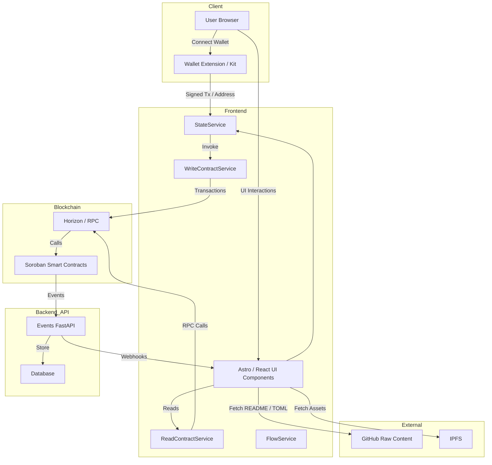
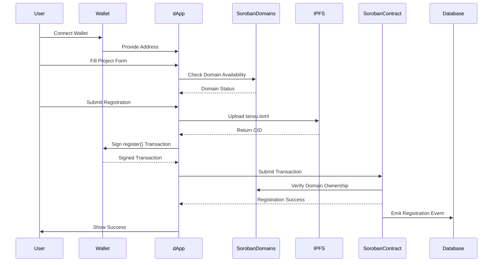
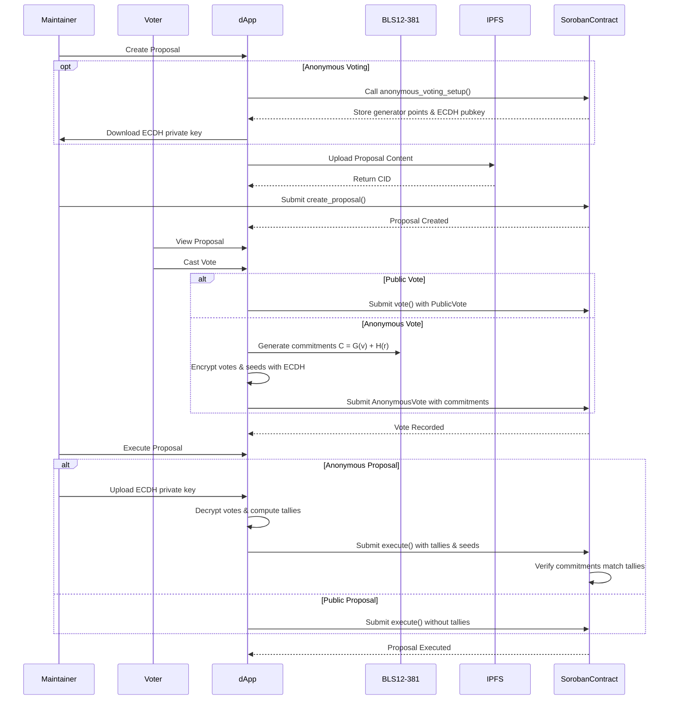
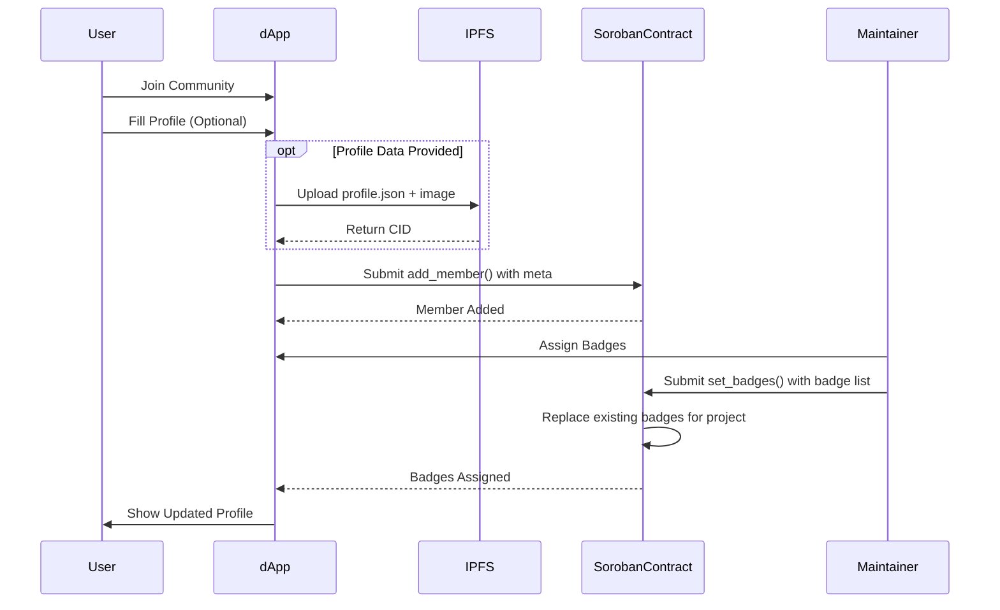
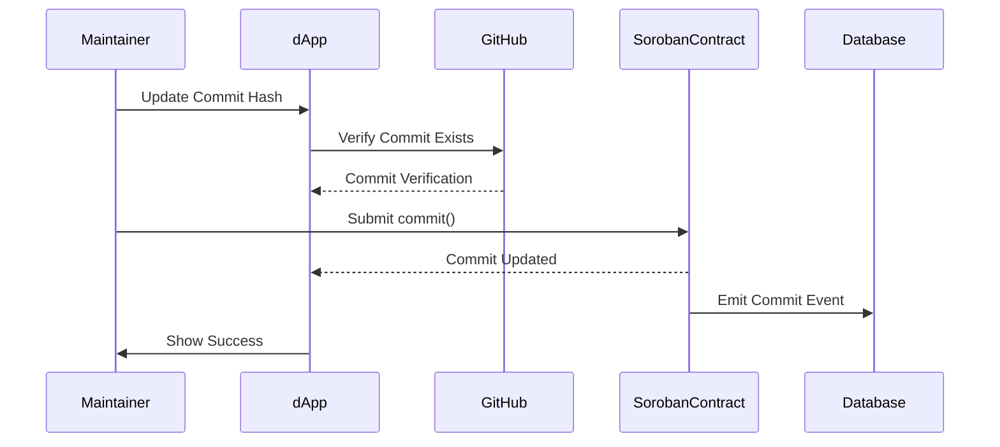
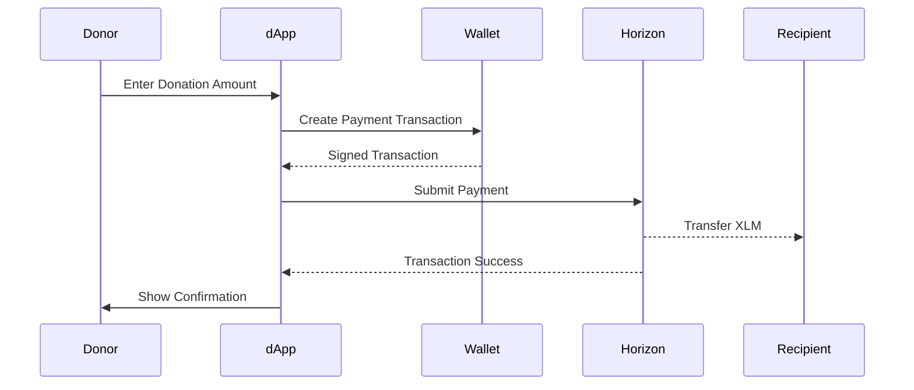

# User Flows

This document provides detailed technical documentation of all user flows in the Tansu protocol, including the architecture components involved and security considerations.

## System Architecture Overview



## 1. Project Registration Flow

### Overview

The project registration flow allows maintainers to register new projects on the Tansu protocol with proper domain verification and metadata storage.

### Flow Diagram



### Technical Components

#### Frontend Components

- **CreateProjectModal**: Multi-step form with validation
- **FlowService.createProjectFlow()**: Orchestrates the registration process
- **Domain Validation**: Real-time domain availability checking

#### Validation Steps

1. **Project Name**: 4-15 lowercase letters, unique check via contract
2. **Maintainers**: Valid Stellar addresses (G...) and GitHub handles
3. **GitHub Repository**: Valid GitHub URL format validation
4. **Organization Info**: Required fields with URL format validation

#### Security Features

- **Domain Squatting Prevention**: Integration with Soroban Domains
- **Input Sanitization**: All user inputs sanitized against XSS
- **Transaction Simulation**: All contract calls simulated before signing
- **IPFS Integrity**: CID verification ensures uploaded content matches

### Error Handling

- **Network Failures**: Graceful retry mechanisms with exponential backoff
- **Domain Conflicts**: Clear error messages with alternative suggestions
- **Transaction Failures**: Detailed error parsing from contract responses
- **IPFS Failures**: Automatic retries with fallback error states

---

## 2. Governance Flow

### Overview

The governance system enables decentralized decision-making through proposals and voting, with optional anonymous voting capabilities.

### Flow Diagram



### Anonymous Voting Technical Details

#### Key Generation

- **ECDH key pairs** generated client-side using Web Crypto API
- **Private key download** required before proposal submission
- **Public key storage** in smart contract for vote encryption

#### Vote Encryption

- **BLS12-381 commitment scheme**: Votes committed as C = G(v) + H(r) where G, H are generator points
- **ECDH encryption**: Votes and seeds encrypted with ECDH public key
- **Commitment verification**: Contract verifies commitments match revealed tallies and seeds

#### Execution Phase

- **Private key upload**: Required to decrypt and tally anonymous votes
- **Verification**: Contract verifies commitments match decrypted votes using BLS12-381
- **Privacy preservation**: Only final tallies revealed, individual votes remain private

### Security Considerations

- **Proposal immutability**: Content stored on IPFS cannot be modified
- **Vote integrity**: Cryptographic commitments prevent vote manipulation
- **Execution authorization**: Only maintainers can execute proposals
- **Time-bounded voting**: Proposals have fixed voting periods (24h minimum, 30d maximum)

---

## 3. Membership Flow

### Overview

Community members can join projects and receive role-based badges from maintainers.

### Flow Diagram



### Profile Data Structure

```json
{
  "name": "User Display Name",
  "description": "User bio in markdown",
  "social": "https://twitter.com/handle",
  "image": "profile-image.jpg"
}
```

### Badge System

- **Role Badges**: Developer, Designer, Auditor, Community Manager
- **Achievement Badges**: Contributor, Reviewer, Bug Hunter
- **Custom Badges**: Project-specific roles and achievements

---

## 4. Version Control Flow

### Overview

Maintainers can update project commit hashes to track code versions on-chain.

### Flow Diagram



### Commit Verification

- **GitHub API Integration**: Verify commit hashes exist in specified repository
- **Hash Format Validation**: Ensure 40-character hexadecimal format
- **Authorization Check**: Only project maintainers can update commits

### Historical Tracking

- **Immutable History**: All commits stored permanently on-chain
- **Event Indexing**: Backend indexes all commit events for efficient querying
- **Timestamp Accuracy**: Ledger timestamps provide precise commit timing

---

## 5. Donation Flow

### Overview

Community members can donate XLM to support projects and their maintainers.

### Flow Diagram


