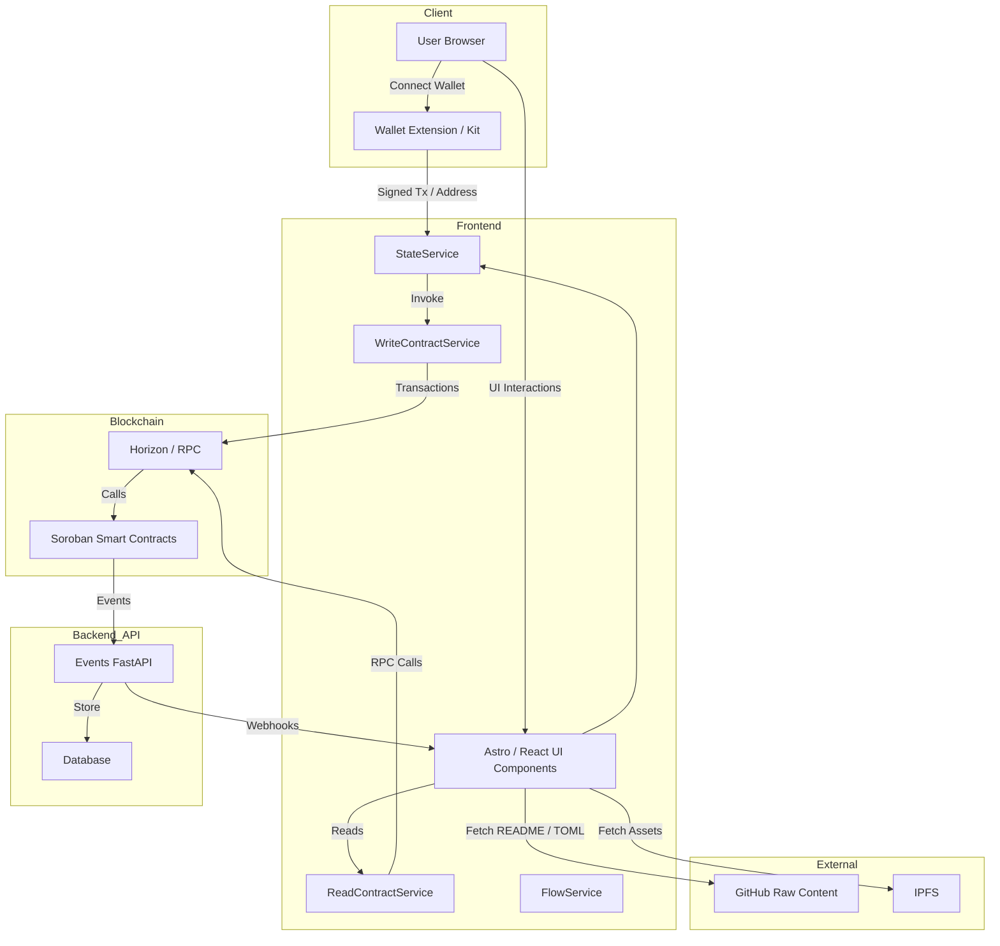
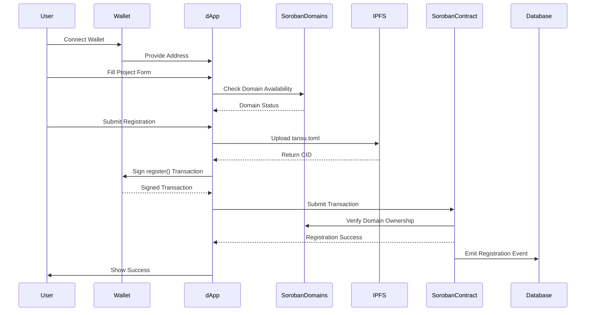
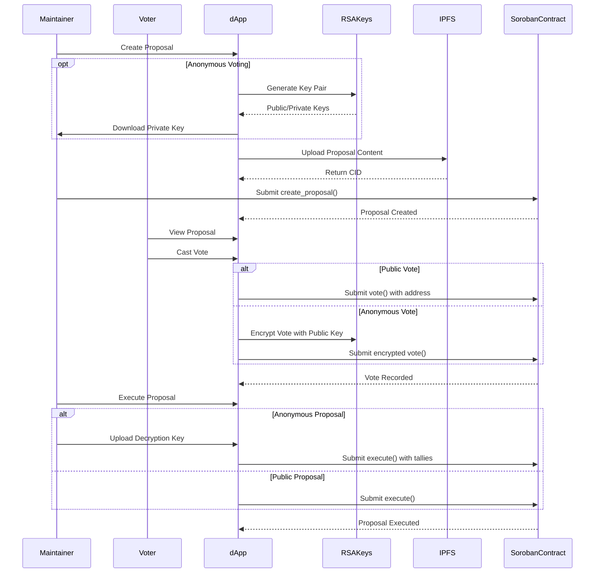
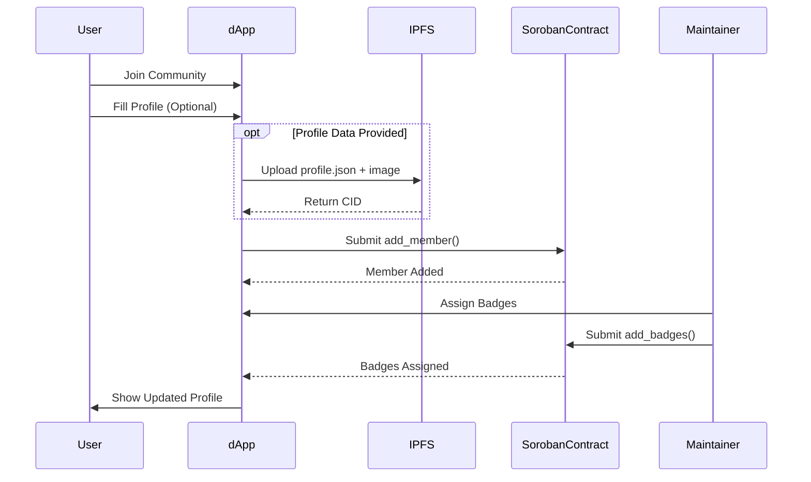
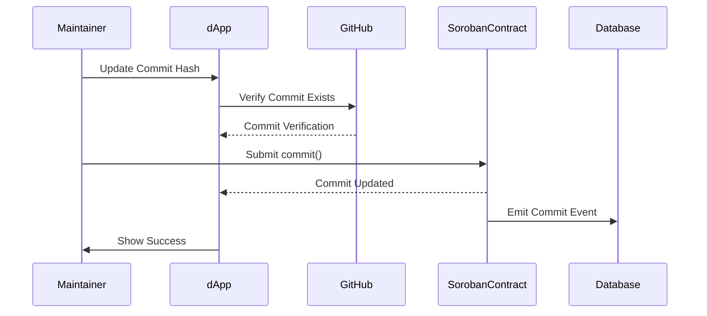
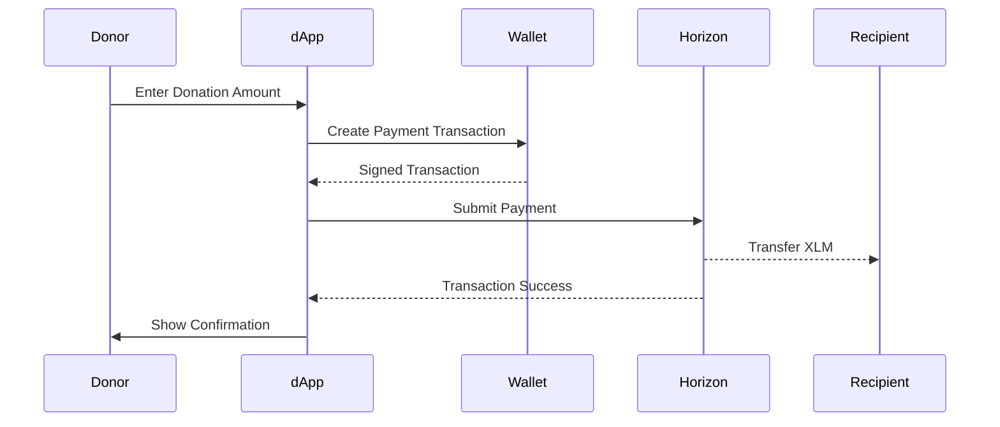

# User Flows

This document provides detailed technical documentation of all user flows in the Tansu protocol, including the architecture components involved and security considerations.

## System Architecture Overview



## 1. Project Registration Flow

### Overview

The project registration flow allows maintainers to register new projects on the Tansu protocol with proper domain verification and metadata storage.

### Flow Diagram



### Technical Components

#### Frontend Components

- **CreateProjectModal**: Multi-step form with validation
- **FlowService.createProjectFlow()**: Orchestrates the registration process
- **Domain Validation**: Real-time domain availability checking

#### Validation Steps

1. **Project Name**: 4-15 lowercase letters, unique check via contract
2. **Maintainers**: Valid Stellar addresses (G...) and GitHub handles
3. **GitHub Repository**: Valid GitHub URL format validation
4. **Organization Info**: Required fields with URL format validation

#### Security Features

- **Domain Squatting Prevention**: Integration with Soroban Domains
- **Input Sanitization**: All user inputs sanitized against XSS
- **Transaction Simulation**: All contract calls simulated before signing
- **IPFS Integrity**: CID verification ensures uploaded content matches

### Error Handling

- **Network Failures**: Graceful retry mechanisms with exponential backoff
- **Domain Conflicts**: Clear error messages with alternative suggestions
- **Transaction Failures**: Detailed error parsing from contract responses
- **IPFS Failures**: Automatic retries with fallback error states

---

## 2. Governance Flow

### Overview

The governance system enables decentralized decision-making through proposals and voting, with optional anonymous voting capabilities.

### Flow Diagram



### Anonymous Voting Technical Details

#### Key Generation

- **RSA 2048-bit keys** generated client-side using Web Crypto API
- **Private key download** required before proposal submission
- **Public key storage** in smart contract for vote encryption

#### Vote Encryption

- **Vote commitment scheme**: Votes encrypted with RSA public key
- **Salt-based binding**: Each vote bound to voter address and proposal ID
- **Zero-knowledge proofs**: Commitment verification without revealing votes

#### Execution Phase

- **Private key upload**: Required to decrypt and tally anonymous votes
- **Verification**: Contract verifies commitments match decrypted votes
- **Privacy preservation**: Only final tallies revealed, individual votes remain private

### Security Considerations

- **Proposal immutability**: Content stored on IPFS cannot be modified
- **Vote integrity**: Cryptographic commitments prevent vote manipulation
- **Execution authorization**: Only maintainers can execute proposals
- **Time-bounded voting**: Proposals have fixed voting periods (25h minimum, 30d maximum)

---

## 3. Membership Flow

### Overview

Community members can join projects and receive role-based badges from maintainers.

### Flow Diagram



### Profile Data Structure

```json
{
  "name": "User Display Name",
  "description": "User bio in markdown",
  "social": "https://twitter.com/handle",
  "image": "profile-image.jpg"
}
```

### Badge System

- **Role Badges**: Developer, Designer, Auditor, Community Manager
- **Achievement Badges**: Contributor, Reviewer, Bug Hunter
- **Custom Badges**: Project-specific roles and achievements

---

## 4. Version Control Flow

### Overview

Maintainers can update project commit hashes to track code versions on-chain.

### Flow Diagram



### Commit Verification

- **GitHub API Integration**: Verify commit hashes exist in specified repository
- **Hash Format Validation**: Ensure 40-character hexadecimal format
- **Authorization Check**: Only project maintainers can update commits

### Historical Tracking

- **Immutable History**: All commits stored permanently on-chain
- **Event Indexing**: Backend indexes all commit events for efficient querying
- **Timestamp Accuracy**: Ledger timestamps provide precise commit timing

---

## 5. Donation Flow

### Overview

Community members can donate XLM to support projects and their maintainers.

### Flow Diagram



### Payment Features

- **Direct Payments**: XLM transfers directly to maintainer addresses
- **Multi-recipient Support**: Donations can be split among multiple maintainers
- **Transaction Transparency**: All donations visible on Stellar blockchain
- **Fee Handling**: Network fees paid by donor

---

## Security Architecture

### Input Validation

- **Zod Schema Validation**: All form inputs validated with type-safe schemas
- **XSS Protection**: DOMPurify sanitization on all user content
- **SQL Injection Prevention**: Parameterized queries in backend
- **Rate Limiting**: API endpoints protected against abuse

### Wallet Security

- **Non-custodial Design**: Private keys never leave user's wallet
- **Transaction Simulation**: All transactions simulated before signing
- **Error Handling**: Graceful handling of wallet disconnections and rejections

### Smart Contract Security

- **Reentrancy Protection**: All contract functions protected against reentrancy
- **Access Controls**: Role-based permissions for sensitive operations
- **Input Validation**: All contract inputs validated and sanitized
- **Overflow Protection**: Safe arithmetic operations throughout

### Data Integrity

- **IPFS Content Addressing**: Content hashes ensure data integrity
- **Contract Events**: All state changes emit verifiable events
- **Cryptographic Signatures**: All transactions cryptographically signed
- **Immutable Storage**: Critical data stored immutably on-chain

---

## Testing and Quality Assurance

### End-to-End Testing

- **Playwright Test Suite**: Comprehensive UI flow testing
- **Network Mocking**: Tests run against mocked Stellar/IPFS responses
- **Error Scenarios**: Full coverage of error conditions and edge cases
- **Performance Testing**: Load time and responsiveness validation

### Security Testing

- **Input Fuzzing**: Automated testing with malicious inputs
- **XSS Protection**: Verified protection against common attack vectors
- **Contract Auditing**: Smart contracts undergo security audits
- **Dependency Scanning**: Regular vulnerability scans of dependencies

This documentation ensures that all user flows are well-understood, properly implemented, and thoroughly tested for a production-ready decentralized application.
